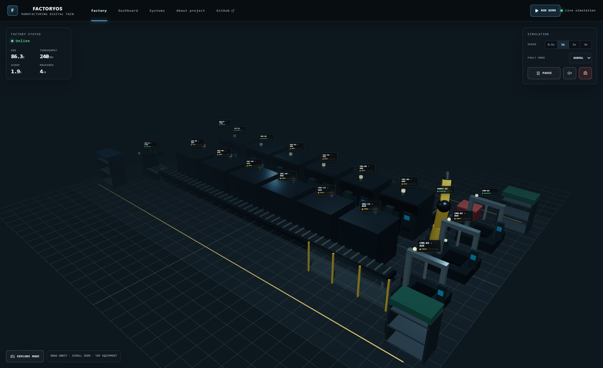

# FactoryOS

**Interactive 3D Manufacturing Digital Twin**

FactoryOS is a portfolio-grade manufacturing cell simulator that connects an interactive 3D factory to live equipment telemetry, production events, quality inspection, fault diagnostics, and event-derived KPIs. It is designed to demonstrate practical experience across manufacturing engineering, automation, troubleshooting, data systems, and modern web development.

[](LICENSE)
[](https://github.com/Jerry-Padilla/FactoryOS/actions/workflows/ci.yml)
[](https://factoryos-three.vercel.app)

[Launch the live FactoryOS simulator](https://factoryos-three.vercel.app)



## Features

- Procedural low-poly factory with two six-machine CNC lines, two enclosed horizontal band saws cutting thick rectangular stock, two parallel directional conveyors, two articulated transfer robots, six CMM stations in straight three-machine banks, material racks, and reject handling
- Branded 3D wayfinding for Jerry&apos;s Automated Machine Shop, Saw, CNC, Milling, and Shipping departments
- Modeled outbound shipping depot with three roll-up dock doors, marked staging lanes, palletized crates, and a forklift
- Six modeled operators cover one adjacent CNC pair each; only the operator assigned to the live traceable workpiece moves, while idle operators no longer create decorative blanks
- Fault-driven repair technicians appear with tools at affected CNC and robotic equipment, then leave when the diagnosed repair is completed
- Twelve production-routed CNCs with modeled vertical spindle cartridges, downward cutters, and alternating rectangular/circular X–Z machining paths; four instrumented assets feed the detailed telemetry and KPI model
- Z-axis conveyor rollers with visible witness marks and playback-speed-synchronized motion
- Two lowered-pose robot arms with damped shoulder, elbow, base, and gripper motion; each services a straight, evenly spaced bank of three CMMs
- A capacity-controlled 20-part WIP pipeline with uniquely serialized billets, no looping conveyor stock, and no operator-owned duplicate geometry
- Order-driven product mix: every rectangular billet is visibly machined into a mounting plate, six-vane impeller, or rocket-engine nozzle; accepted output is scheduled toward a 50/30/20 mix
- Live spindle, robot, and inspection telemetry with smooth signal changes
- Machine selection, start/stop controls, status lights, and floating labels
- Five evidence-based CNC and robot fault scenarios
- Guided diagnostic questions and repair workflows
- Automatic fault modes plus a manual random-fault control
- Availability, performance, quality, OEE, throughput, scrap, utilization, and cycle-time calculations
- Live uptime analytics by telemetry-instrumented machine and weighted machine type (CNC, robot, and CMM), derived from accumulated running and scheduled time
- Live Recharts analytics and a bounded manufacturing event stream
- Live status table for all 22 assets with fault codes, operator stops, blocked-flow reasons, idle conditions, and direct machine inspection links
- Desktop and touch orbit controls
- Desktop WASD/pointer-lock and mobile joystick Explore Modes
- Skippable system startup and cancellable guided demo
- Opt-in synthesized Web Audio machine ambience and alarm cues
- Responsive operator UI with mobile bottom sheets
- Graceful dashboard fallback when WebGL is unavailable

## Technology

- Next.js 16 App Router
- React 19 and TypeScript
- React Three Fiber, Three.js, and Drei
- Zustand
- Recharts
- Tailwind CSS
- Lucide React
- Vitest and Testing Library

## Architecture

```text
React Three Fiber scene
          ↓
Discrete-time simulation engine
          ↓
Typed Zustand operational state
          ↓
Telemetry + fault + production engines
          ↓
Event-derived KPI engine
          ↓
React operator panels + Recharts dashboard
```

All manufacturing behavior runs client-side. The presentation layer does not create independent telemetry or KPI values; both the factory view and dashboard consume the same simulation state.

The simulation uses a single bounded clock. It supports pause and accelerated time without stacking browser timers. Station capacity checks hold the live workpiece when downstream equipment is unavailable, allowing faults to create visible production and KPI consequences. A deficit-based scheduler compares accepted counts with the target product mix before releasing each billet, so the visible output converges on the configured order profile rather than being selected randomly.

## Production Flow

The full visual cell begins with two horizontal band saws at the upstream end of two parallel central conveyors. SAW-01 feeds the six-machine south row and SAW-02 feeds the six-machine north row. The dispatcher alternates lines and rotates assignments across CNC-01 through CNC-12. Each cut billet appears only when released from its saw, travels only as far as its assigned machine&apos;s front pickup, and waits there if that machine is occupied. Up to 20 serialized workpieces can occupy the capacity-controlled pipeline, allowing the farther machines and both rows to work concurrently without overlapping parts or invented stock. During machining, each billet becomes its scheduled plate, impeller, or rocket nozzle; that same physical workpiece returns to its conveyor lane, reaches the matching robot, and is placed on one of three square CMMs arranged in a straight bank behind that robot.

```text
South stock → SAW-01 → assigned CNC-01…06 → south lane → ROBOT-01 → CMM-01…03
North stock → SAW-02 → assigned CNC-07…12 → north lane → ROBOT-02 → CMM-04…06
                                                                  ├─ Pass → Complete
                                                                  └─ Fail → Reject bin
```

Nominal cycles are 4 seconds for saw cutting and delivery to the assigned pickup, 8 seconds for CNC-01, 7 seconds for CNC-02, 24 seconds for the ten visual production CNCs, 3 seconds for finished-part conveyor travel, 3 seconds for robot transfer, and 5 seconds for inspection. The longer background cycles balance six CNCs per line against one saw. Normal output targets a 97–99% first-pass yield; abnormal machine temperatures and active faults increase quality risk. Only inspection-passed parts increment product-mix counts, and the dashboard compares accepted output with its target.

## Local Development

### Prerequisites

- Node.js 20.9 or newer (Node 22 LTS recommended)
- npm 10 or newer

```bash
npm install
npm run dev
```

Open [http://localhost:3000](http://localhost:3000).

### Verification

```bash
npm test
npm run lint
npm run build
npm start
```

## Controls

### Orbit mode

- Left drag / one-finger drag: orbit
- Scroll / pinch: zoom
- Right drag: pan
- Click / tap equipment: inspect

### Explore mode

- `W`, `A`, `S`, `D`: move
- Mouse: look
- `E`: interact with centered equipment
- `Esc`: exit
- Mobile: virtual joystick, drag-to-look, and Interact button

Audio is off by default and starts only after the operator enables it.

## Vercel Deployment

No database, backend, environment variables, paid APIs, or external model assets are required.

The production deployment is available at [factoryos-three.vercel.app](https://factoryos-three.vercel.app).

1. Push the project to a Git repository.
2. Import the repository in Vercel.
3. Keep Framework Preset set to **Next.js**.
4. Keep Build Command set to `npm run build`.
5. Deploy.

The application is statically prerendered and the simulation starts in the browser.

## Project Structure

```text
app/                         App Router entry point and global styles
components/factory/          Procedural 3D equipment, parts, and controls
components/ui/               HUD, dashboard, panels, navigation, and project views
lib/simulation/              Production, telemetry, fault, KPI, and positioning logic
store/useFactoryStore.ts     Central operational state and actions
types/factory.ts             Domain model and public simulation interfaces
public/models/               Reserved for optional optimized local models
public/textures/             Reserved for optional optimized local textures
```

## Configuration

The public repository URL is exported as `GITHUB_URL` in `lib/constants.ts` and is used by the in-app navigation.

## Contributing and Security

Contributions are welcome under the guidelines in [CONTRIBUTING.md](CONTRIBUTING.md). Participation is governed by the [Code of Conduct](CODE_OF_CONDUCT.md).

Do not report vulnerabilities in public issues. Follow [SECURITY.md](SECURITY.md) and use GitHub private vulnerability reporting.

FactoryOS processes only synthetic in-browser simulation data. See [PRIVACY.md](PRIVACY.md) for details and [NOTICE.md](NOTICE.md) for the industrial-use and safety disclaimer.

Automatic fault windows:

Automatic faults default to **Off** so ordinary production does not stop unexpectedly. Operators can opt into a frequency or use the manual fault trigger.

- Off: disabled
- Low: 4–6 simulated minutes
- Normal: 2–4 simulated minutes
- High: 45–90 simulated seconds

## Future Improvements

- Persist optional scenario snapshots in local storage
- Add energy consumption and maintenance cost models
- Add configurable product routings and takt-time scenarios
- Import lightweight GLTF equipment variants
- Add operator training scores and scenario completion history
- Add automated browser-level visual regression tests

## License

FactoryOS is available under the [MIT License](LICENSE). Third-party packages remain subject to their respective licenses; see [THIRD_PARTY_NOTICES.md](THIRD_PARTY_NOTICES.md).
